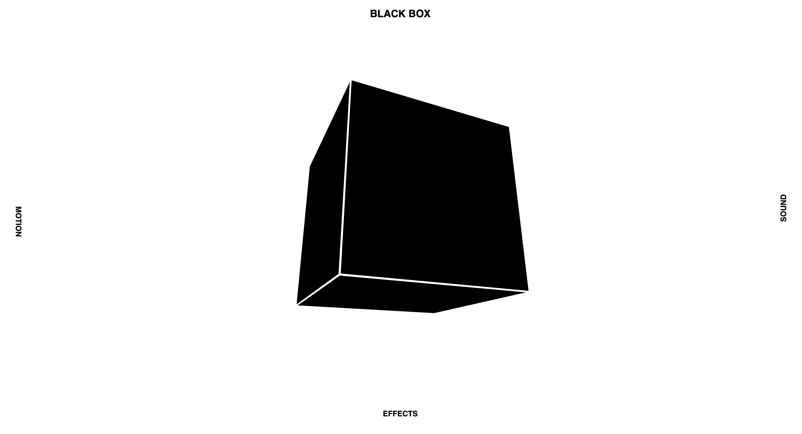
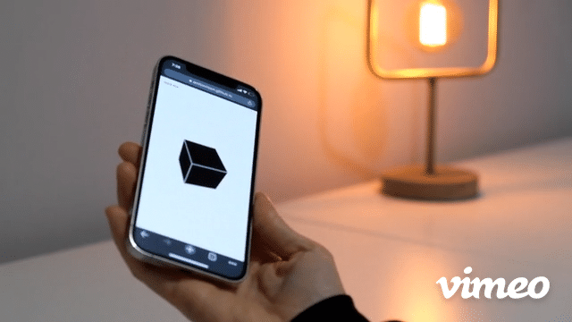

# Black Box

[Black Box](https://alextownson.github.io/black-box/) is a motion controlled instrument made using P5.js. It is designed for mobile use but it can also be used on desktop with a mouse to control movement. To begin playback touch the box or press the space bar. Move the box to control the effects. 

## Concept

I wanted this instrument to represent how I feel about our current techno-cultural moment; In short, my feelings are that I love technology but I despise the ways it’s being implemented in our lives. My original concept for the instrument was to make salient all of the ways we are being tracked. This led me to consider how this technology works and the idea of black boxes. What I ended up creating is an instrument with very little instructions on how to use it. The only interface is the black box which is interacted with through touch and gyroscope data collected from a mobile device. I wanted to make a statement about how we do not know how our tools work, and how the ways in which we use them are limited by the companies creating said tools.

## Code 

Using P5.js I've created a conditional statement to check whether a user is on desktop or mobile. If the later, the program requests permission to access sensors. Once access is granted x and y rotational data is stored in variables. The variables are then used to control two effects; delay and reverb which are apart of the P5.sound library. I found the easiest way to do this was to apply the effects to the audio file with a completely dry mix. A change in the device rotation then controls how dry or wet the audio signal is and which effect is being applied. On a desktop, the same logic is used but rather than tracking rotation it tracks the x and y coordinates of the mouse.    